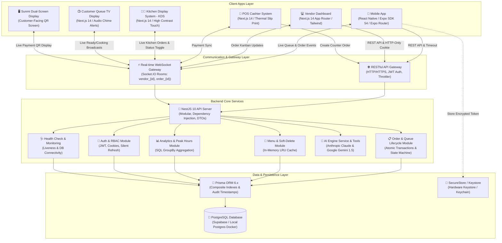
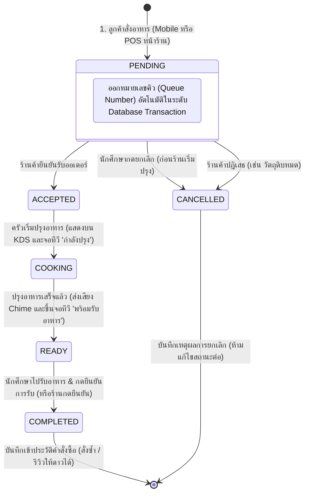

# 🎓 Campus Food: Smart Canteen & AI-Powered Food Ordering Ecosystem 🍔⚡

> **ระบบสั่งอาหารโรงอาหารมหาวิทยาลัยอัจฉริยะแบบครบวงจร (Full-cycle Smart Canteen Platform)**  
> พัฒนาด้วยสถาปัตยกรรม **Monorepo (TypeScript 100%)** ครอบคลุมทั้ง **แอปพลิเคชันมือถือนักศึกษา**, **เว็บแดชบอร์ดร้านค้า**, **ระบบคิดเงินหน้าร้าน (POS)**, **จอแสดงผลในครัว (KDS)**, **จอแสดงคิวลูกค้า (Queue TV Board)**, **จอสอง Sunmi POS** และ **ผู้ช่วย AI อัจฉริยะ "น้องหยก"** พร้อมระบบติดตามคิวและคำสั่งซื้อแบบ **Real-time (WebSockets)**

---

## 📌 สารบัญ (Table of Contents)

1. [🌟 ภาพรวมของโครงการและปัญหาที่แก้ไข (Project Overview & Problem Statement)](#-ภาพรวมของโครงการและปัญหาที่แก้ไข-project-overview--problem-statement)
2. [🏗️ สถาปัตยกรรมระบบและแผนผังการทำงาน (System Architecture & Diagrams)](#️-สถาปัตยกรรมระบบและแผนผังการทำงาน-system-architecture--diagrams)
3. [📦 ส่วนประกอบภายใน Monorepo (Project Modules Breakdown)](#-ส่วนประกอบภายใน-monorepo-project-modules-breakdown)
4. [🛠️ ตารางเทคโนโลยีที่เลือกใช้ (Technology Stack Overview)](#️-ตารางเทคโนโลยีที่เลือกใช้-technology-stack-overview)
5. [💡 เหตุผลเบื้องหลังการเลือก Framework & Tech Stack (Engineering Rationale / ADR)](#-เหตุผลเบื้องหลังการเลือก-framework--tech-stack-engineering-rationale--adr)
6. [✨ ฟีเจอร์หลักของระบบ (Key Features & Capabilities)](#-ฟีเจอร์หลักของระบบ-key-features--capabilities)
7. [🔒 ความปลอดภัยและคุณภาพซอฟต์แวร์ (Security & Quality Engineering)](#-ความปลอดภัยและคุณภาพซอฟต์แวร์-security--quality-engineering)
8. [📁 โครงสร้างโฟลเดอร์ของโปรเจกต์ (Directory Structure)](#-โครงสร้างโฟลเดอร์ของโปรเจกต์-directory-structure)
9. [🚀 คู่มือการติดตั้งและการเริ่มใช้งาน (Getting Started & Setup Guide)](#-คู่มือการติดตั้งและการเริ่มใช้งาน-getting-started--setup-guide)
10. [🐳 การรันด้วย Docker Compose (Docker Containerization)](#-การรันด้วย-docker-compose-docker-containerization)
11. [👥 บัญชีผู้ใช้ตัวอย่างสำหรับทดสอบ (Demo Accounts & Seed Data)](#-บัญชีผู้ใช้ตัวอย่างสำหรับทดสอบ-demo-accounts--seed-data)

---

## 🌟 ภาพรวมของโครงการและปัญหาที่แก้ไข (Project Overview & Problem Statement)

### 🔴 ปัญหาเดิมของโรงอาหารมหาวิทยาลัย (Pain Points)

1. **ความแออัดและคิวยาวในช่วงเวลาพักเที่ยง**: นักศึกษาต้องเสียเวลาพักอันมีค่าไปกับการยืนรอคิวหน้าร้านอาหาร โดยไม่รู้ว่าต้องรอนานเท่าใด
2. **ปัญหา "มื้อนี้กินอะไรดี?"**: นักศึกษาเกิดความลังเล มีข้อจำกัดด้านงบประมาณ หรือความต้องการทางโภชนาการเฉพาะ (คลีน, เผ็ดน้อย, ฮาลาล) แต่ไม่มีเครื่องมือช่วยตัดสินใจ
3. **ความสับสนในการจัดการคิวของร้านค้า**: แม่ค้าต้องรับออเดอร์ จดมือ ทำอาหาร คิดเงิน และคอยตะโกนเรียกคิวพร้อมกัน ทำให้เกิดความผิดพลาด ลืมออเดอร์ หรือคิดเงินผิด
4. **ขาดข้อมูลสถิติเพื่อการบริหารสต็อก**: ร้านค้าไม่ทราบช่วงเวลาเร่งด่วนที่แท้จริง (Peak Hours) และยอดขายรายเมนู ทำให้เตรียมวัตถุดิบขาดหรือเหลือทิ้ง

### 🟢 โซลูชันของ Campus Food Ecosystem

**Campus Food** เชื่อมต่อทุกภาคส่วนในโรงอาหารเข้าด้วยกันเป็นระบบดิจิทัลแบบครบวงจร (Single Unified Ecosystem):

- **📱 Student Mobile App**: สั่งอาหารล่วงหน้า ระบุทานที่ร้านหรือสั่งกลับบ้าน ติดตามสถานะคิวแบบ Real-time และมี **AI "น้องหยก"** ช่วยแนะนำเมนูตามงบและรสชาติ
- **💻 Vendor Web Dashboard**: จัดการออเดอร์ในรูปแบบ **Kanban Board**, จัดการเมนู/สต็อก และดูรายงานสถิติยอดขายพร้อมช่วงเวลาขายดี
- **🧾 POS System (`/pos`)**: ระบบคิดเงินหน้าร้านสำหรับพนักงาน ออกบัตรคิว ชำระเงินผ่าน PromptPay Dynamic QR หรือเงินสด พร้อมสั่งพิมพ์สลิปความร้อน (Thermal Receipt)
- **👨‍🍳 Kitchen Display System (`/kds`)**: หน้าจอสัมผัสสำหรับพ่อครัว/แม่ครัวในครัว เห็นออเดอร์ชัดเจน มีตัวจับเวลาความล่าช้า และเสียงกระดิ่งแจ้งเตือน
- **📺 Customer Queue Display (`/queue-display`)**: หน้าจอทีวีขนาดใหญ่ติดตั้งหน้าร้าน/โรงอาหาร แสดงเลขคิว "กำลังปรุง" และ "พร้อมรับอาหาร" อัปเดตสดแบบเสี้ยววินาที
- **🖥️ Sunmi Dual-Screen Display (`/sunmi`, `/sunmi-display`)**: ระบบจอแสดงผลสองด้านสำหรับเครื่อง Sunmi Android POS แสดงยอดเงินและ QR Code ให้ลูกค้าสแกนจ่าย

---

## 🏗️ สถาปัตยกรรมระบบและแผนผังการทำงาน (System Architecture & Diagrams)

### 1. แผนผังสถาปัตยกรรมภาพรวม (System Architecture Diagram)



---

### 2. วงจรชีวิตของคำสั่งซื้อ (Order Lifecycle State Machine)



---

## 📦 ส่วนประกอบภายใน Monorepo (Project Modules Breakdown)

```text
campus-food-ordering-monorepo/
├── apps/
│   ├── backend/            # 🚀 NestJS REST API Server, WebSocket Gateway & AI Services
│   ├── web/                # 💻 Next.js 14 Web App (Dashboard, POS, KDS, Queue TV, Sunmi)
│   └── mobile/             # 📱 React Native Expo App (สำหรับนักศึกษา iOS & Android)
├── packages/
│   └── shared-types/       # 📦 คลัง Type Definitions, Enums, DTOs กลางที่แชร์ร่วมกัน 100%
├── .github/workflows/      # ⚙️ GitHub Actions CI Pipeline
├── docker-compose.yml      # 🐳 Full-stack Docker Orchestration
├── pnpm-workspace.yaml     # กำหนดขอบเขต Workspace ของ Monorepo
├── tsconfig.base.json      # Base TypeScript Configuration
└── README.md
```

---

## 🛠️ ตารางเทคโนโลยีที่เลือกใช้ (Technology Stack Overview)

| เลเยอร์ / ส่วนงาน         | เทคโนโลยีที่เลือกใช้            | ภาษา / เครื่องมือ   | บทบาทและหน้าที่ในระบบ                                                         |
| ------------------------- | ------------------------------- | ------------------- | ----------------------------------------------------------------------------- |
| **Monorepo Architecture** | **pnpm Workspace v11**          | YAML / Node.js      | จัดการ Dependency, แชร์แพ็กเกจ และเร่งความเร็วในการ Build                     |
| **Language Baseline**     | **TypeScript 5.x**              | TypeScript          | ภาษาหลัก 100% ทั้ง Frontend, Mobile, Backend และ Shared Packages              |
| **Backend Framework**     | **NestJS 10**                   | TypeScript          | แบ็กเอนด์ระดับ Enterprise (Modular, Dependency Injection, Clean Architecture) |
| **Database ORM**          | **Prisma ORM 6.x**              | Prisma Schema / SQL | ตัวเชื่อมฐานข้อมูลแบบ Type-safe, จัดการ Composite Indexes และ Audit Timestamps |
| **Database**              | **PostgreSQL 16 (Supabase)**    | SQL / Relational    | ฐานข้อมูลหลัก รองรับ ACID Transactions และ PgBouncer Connection Pooling       |
| **In-Memory Cache**       | **Bounded LRU Memory Cache**    | TypeScript          | แคชข้อมูลเมนูและร้านค้า ป้องกัน Memory Leak ด้วย Max Size 500 รายการ          |
| **Real-time Engine**      | **Socket.IO (WebSockets)**      | WebSocket Protocol  | ระบบรับ-ส่งสัญญาณแจ้งเตือนออเดอร์และบัตรคิวแบบ Real-time พร้อม Connection Auth |
| **Web Framework**         | **Next.js 14 (App Router)**     | TSX / React 18      | ระบบเว็บแอปพลิเคชันสำหรับ Dashboard, POS, KDS, Queue Display และ Sunmi Display |
| **Web Styling**           | **Tailwind CSS + Lucide Icons** | PostCSS / CSS3      | ออกแบบดีไซน์ทันสมัย Responsive Dark Glassmorphism                             |
| **Web Data & Cache**      | **TanStack React Query v5**     | TypeScript          | จัดการ Server State, Caching, Optimistic Updates และ Background Refetching    |
| **Mobile Framework**      | **React Native (Expo SDK 54)**  | TSX / React 19      | พัฒนา Cross-Platform Mobile App (iOS & Android)                               |
| **Mobile Routing**        | **Expo Router v6**              | TypeScript          | ระบบจัดการหน้าจอแบบ File-based Navigation Routing                             |
| **Mobile Security**       | **Expo SecureStore Adapter**    | TypeScript          | จัดการ State น้ำหนักเบา (Zustand) พร้อมเข้ารหัส Token ใน Hardware Keystore    |
| **AI Intelligence**       | **Anthropic Claude & Gemini**   | REST / AI SDK       | สมองกลผู้ช่วย AI "น้องหยก" และระบบ AI Analytics Copilot ด้วย Function Calling |
| **DevOps & CI**           | **Docker & GitHub Actions**     | Dockerfile / YAML   | Multi-stage Docker Builds, Compose Orchestration และ Automated CI Pipeline     |
| **Testing Suite**         | **Jest + ts-jest (81 Tests)**   | TypeScript          | ชุดทดสอบ Unit Tests ครอบคลุม 8 Test Suites ผ่าน 100%                          |

---

## 🔒 ความปลอดภัยและคุณภาพซอฟต์แวร์ (Security & Quality Engineering)

1. **Dynamic PromptPay per Vendor**:
   - สร้าง Dynamic EMVCo QR Code ผูกตามเบอร์โทรศัพท์/เลขประจำตัวผู้เสียภาษีเฉพาะของแต่ละร้านค้า (`vendor.promptpayId`) จากฐานข้อมูลโดยตรง ป้องกันการ Hardcode
2. **WebSocket Connection Authentication & Room Isolation**:
   - ตรวจสอบ JWT Handshake ในช่วง Connection และบังคับ Authorization สิทธิ์การเข้าห้อง `vendor_{id}` เฉพาะเจ้าของร้านหรือ Admin
3. **IDOR (Insecure Direct Object References) Protection**:
   - ตรวจสอบสิทธิ์ความเป็นเจ้าของใน `GET /orders/:id` อนุญาตเฉพาะนักศึกษาเจ้าของออเดอร์ เจ้าของร้านค้าคู่กรณี หรือ Admin เท่านั้น
4. **Order State Machine Transition Validation**:
   - กำหนด `VALID_ORDER_TRANSITIONS` อย่างรัดกุม ป้องกันการข้ามขั้นตอน และบล็อกการแก้ไขออเดอร์ที่อยู่ในสถานะสิ้นสุด (`COMPLETED`, `CANCELLED`)
5. **Database Aggregation for Analytics**:
   - ใช้ `prisma.order.groupBy` และ `prisma.orderItem.groupBy` คำนวณยอดขาย สถิติช่วงเวลาเร่งด่วน และเมนูขายดีในระดับ Database Engine
6. **In-Memory Bounded LRU Cache**:
   - สร้าง Cache Layer แบบจำกัดขนาด (Max Size 500, TTL 15 วินาที) สำหรับ `MenuService` และ `VendorsService` ป้องกันปัญหา Memory Leak
7. **HTTP-Only Cookies & Web Silent Refresh**:
   - รองรับการจัดเก็บ Token ใน HTTP-Only Cookie และมีระบบ Silent Refresh Token อัตโนมัติใน Next.js Web Interceptor
8. **Mobile Request Timeout & AbortController**:
   - จำกัด Timeout 15 วินาทีใน Mobile API Client พร้อมแจ้งเตือนเป็นภาษาไทยเมื่อสัญญาณอินเทอร์เน็ตขาดหาย
9. **Prisma Audit Fields & Composite Indexes**:
   - เพิ่ม `updatedAt` (`@updatedAt`) ในทุก Entity และสร้าง Composite Indexes (`[vendorId, status]`, `[vendorId, createdAt, status]`) เพื่อเร่งความเร็วการ Query
10. **CORS Hardening**:
    - ล็อก Origin Whitelist อย่างเข้มงวดเมื่อรันบน Production และแสดง Warning Log ใน Development Mode

---

## 📁 โครงสร้างโฟลเดอร์ของโปรเจกต์ (Directory Structure)

```text
proj/
├── apps/
│   ├── backend/                     # 🚀 NestJS REST API & WebSocket Server
│   │   ├── Dockerfile               # Production Multi-stage Dockerfile (Node 22 Alpine)
│   │   ├── prisma/
│   │   │   ├── schema.prisma        # Database Schema & Index Definitions
│   │   │   └── seed.ts              # Seeding 8 realistic vendors and 35+ menu items
│   │   └── src/
│   │       ├── ai/                  # AI Copilot & Extracted AiToolsExecutor
│   │       ├── analytics/           # Sales Statistics & Peak Hours Aggregator
│   │       ├── auth/                # JWT Auth, Refresh Token, Passport Strategies
│   │       ├── common/cache/        # MemoryCacheService (LRU Bounded Cache)
│   │       ├── health/              # HealthController (Liveness & DB Connectivity)
│   │       ├── menu/                # Menu Management, Soft Delete & Cache
│   │       ├── notifications/       # Socket.IO WebSocket Gateway with Auth & Rooms
│   │       ├── orders/              # Order State Machine, Mapper & Transactions
│   │       ├── prisma/              # Prisma Service & Database Connection
│   │       └── vendors/             # Vendor Profile & Store Status
│   │
│   ├── mobile/                      # 📱 React Native (Expo SDK 54) Student App
│   │   └── src/
│   │       ├── app/                 # Expo Router Navigation (Tabs, Vendor, Order)
│   │       ├── components/          # Reusable UI (Ai, Cart, Orders, Modals)
│   │       ├── lib/                 # SecureStorageAdapter, API Client with Timeout
│   │       └── stores/              # Zustand Stores (AuthStore, CartStore)
│   │
│   └── web/                         # 💻 Next.js 14 App Router (Vendor Suite)
│       ├── Dockerfile               # Production Multi-stage Dockerfile
│       └── src/
│           ├── app/                 # Dashboard, POS, KDS, Queue TV, Sunmi
│           ├── components/          # Kanban Cards, Charts, Slip Templates, Modals
│           └── lib/                 # Axios with Silent Refresh, Sockets, Toast
│
├── packages/
│   └── shared-types/                # 📦 Centralized Shared TypeScript Definitions
│
├── .github/workflows/ci.yml         # ⚙️ GitHub Actions CI Workflow
├── docker-compose.yml               # 🐳 Full-stack Docker Orchestration
├── pnpm-workspace.yaml             # pnpm Workspace Configuration
├── tsconfig.base.json              # Shared Base TypeScript Rules
├── .env.example                    # Sample Root Environment Variables
└── README.md
```

---

## 🚀 คู่มือการติดตั้งและการเริ่มใช้งาน (Getting Started & Setup Guide)

### 1. ความต้องการของระบบ (Prerequisites)

- **Node.js**: เวอร์ชัน `>= 22.13` (แนะนำ Node.js 22 LTS)
- **pnpm**: เวอร์ชัน `>= 11.x` (`npm install -g pnpm@11`)
- **PostgreSQL**: บัญชี [Supabase](https://supabase.com) (ฟรี) หรือ Local PostgreSQL
- **Expo Go App**: สำหรับทดสอบ Mobile App บน iOS หรือ Android

---

### 2. ติดตั้ง Dependencies และ Build Types

```bash
# 1. โคลนโปรเจกต์
git clone https://github.com/azazxxc147896325-beep/ProjectEnd.git
cd ProjectEnd

# 2. ติดตั้ง dependencies ทั้งหมดใน monorepo
pnpm install

# 3. คอมไพล์ shared-types
pnpm build:types
```

---

### 3. ตั้งค่าตัวแปรสภาพแวดล้อม (Environment Variables)

คัดลอกไฟล์ตัวอย่าง `.env.example` ไปยังแต่ละโมดูล:

#### 🔹 `apps/backend/.env`:
```env
PORT=4000
NODE_ENV=development
DATABASE_URL="postgresql://postgres:[PASSWORD]@[HOST]:6543/postgres?pgbouncer=true"
DIRECT_URL="postgresql://postgres:[PASSWORD]@[HOST]:5432/postgres"
JWT_SECRET="super-secret-jwt-key-change-in-production"
JWT_REFRESH_SECRET="super-secret-jwt-refresh-key-change-in-production"
FRONTEND_URL="http://localhost:3000"
GEMINI_API_KEY="your-google-gemini-api-key"
ANTHROPIC_API_KEY="your-anthropic-api-key"
```

#### 🔹 `apps/web/.env.local`:
```env
NEXT_PUBLIC_API_URL=http://localhost:4000/api
NEXT_PUBLIC_WS_URL=http://localhost:4000
```

#### 🔹 `apps/mobile/.env`:
```env
EXPO_PUBLIC_API_URL=http://localhost:4000/api
EXPO_PUBLIC_WS_URL=http://localhost:4000
```

---

### 4. ซิงค์ฐานข้อมูลและสร้างข้อมูลตัวอย่าง (Database Migration & Seeding)

```bash
# Push schema ขึ้นไปยังฐานข้อมูล
pnpm --filter @campus-food/backend prisma:push

# รัน Seed เพื่อสร้างร้านค้า 8 ร้าน และเมนูอาหารกว่า 35+ รายการ
pnpm --filter @campus-food/backend seed
```

---

### 5. คำสั่งสำหรับรันโปรเจกต์ (Development Scripts)

| ส่วนงาน | คำสั่ง | URL เริ่มต้น / การเข้าถึง |
| :--- | :--- | :--- |
| **🚀 Backend API** | `pnpm dev:backend` | [http://localhost:4000/api](http://localhost:4000/api) (Swagger: `/api/docs`, Health: `/api/health`) |
| **💻 Vendor Web Suite** | `pnpm dev:web` | [http://localhost:3000](http://localhost:3000) (Dashboard, POS, KDS, Queue) |
| **📱 Student Mobile App** | `pnpm dev:mobile` | สแกน QR Code ผ่าน **Expo Go** หรือกด `i` (iOS Simulator) / `a` (Android) |

#### 🔗 ทางลัดหน้า Web Suite สำหรับทดสอบ:
- **Vendor Dashboard**: `http://localhost:3000/dashboard`
- **POS หน้าร้าน**: `http://localhost:3000/pos`
- **KDS จอในครัว**: `http://localhost:3000/kds`
- **จอแสดงคิวลูกค้า TV**: `http://localhost:3000/queue-display`
- **จอสอง Sunmi Display**: `http://localhost:3000/sunmi`

---

### 6. การทดสอบ Unit Tests (Automated Testing)

```bash
# รัน Unit Tests ทั้งหมดใน Backend (81 Tests)
pnpm --filter @campus-food/backend test
```

---

## 🐳 การรันด้วย Docker Compose (Docker Containerization)

หากต้องการรันระบบทั้งหมด (PostgreSQL + Backend + Web) ในคำสั่งเดียว:

```bash
# เริ่มต้นการทำงานของ Container ทั้งหมด
docker compose up -d

# ตรวจสอบสถานะการทำงาน
docker compose ps

# ดูบันทึกการทำงาน (Logs)
docker compose logs -f

# หยุดการทำงาน
docker compose down
```

---

## 👥 บัญชีผู้ใช้ตัวอย่างสำหรับทดสอบ (Demo Accounts & Seed Data)

ระบบได้เตรียมข้อมูลร้านค้าจำลองในโรงอาหารไว้ 8 ร้าน พร้อมเมนูอาหารครบถ้วน (รหัสผ่านทุกบัญชีคือ: `password123`):

| บทบาท (Role) | ร้านค้า / ผู้ใช้ | อีเมล (Email) | รหัสผ่าน (Password) |
| :--- | :--- | :--- | :--- |
| 👩‍🍳 **Vendor 1** | ครัวป้าสมใจ (อาหารตามสั่ง/กะเพรา) | `vendor.somjai@campus.ac.th` | `password123` |
| 🍗 **Vendor 2** | ข้าวมันไก่เฮียชัย ประตู 1 | `vendor.chaichicken@campus.ac.th` | `password123` |
| 🍜 **Vendor 3** | เตี๋ยวเรืออยุธยา สูตรโบราณ | `vendor.boatnoodle@campus.ac.th` | `password123` |
| 🥗 **Vendor 4** | แซ่บอีสาน ส้มตำ-ไก่ย่าง | `vendor.zaabisarn@campus.ac.th` | `password123` |
| 🍛 **Vendor 5** | ข้าวแกงปักษ์ใต้ คุณนายเรณู | `vendor.southern@campus.ac.th` | `password123` |
| ☕ **Vendor 6** | Green Canteen & Cafe (เครื่องดื่ม/เบเกอรี่) | `vendor.greencafe@campus.ac.th` | `password123` |
| 🇯🇵 **Vendor 7** | Tokyo Donburi ข้าวหน้าญี่ปุ่น | `vendor.tokyodonburi@campus.ac.th` | `password123` |
| 🍲 **Vendor 8** | ครัวฮาลาล ซาบีฮะห์ | `vendor.halalkitchen@campus.ac.th` | `password123` |
| 🎓 **Student** | สมชาย สายกิน (นักศึกษา) | _สมัครสมาชิกใหม่ผ่านหน้าแอปมือถือได้ทันที_ | - |

---

<div align="center">
  <b>🎓 Campus Food Ordering System</b> — พัฒนาด้วยความพิถีพิถัน เพื่อยกระดับประสบการณ์การสั่งอาหารในโรงอาหารมหาวิทยาลัยให้สะดวก รวดเร็ว และทันสมัยที่สุด ✨
</div>
