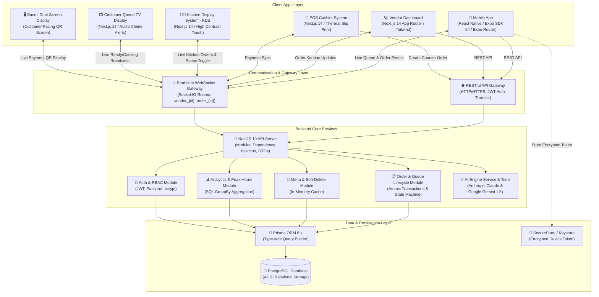
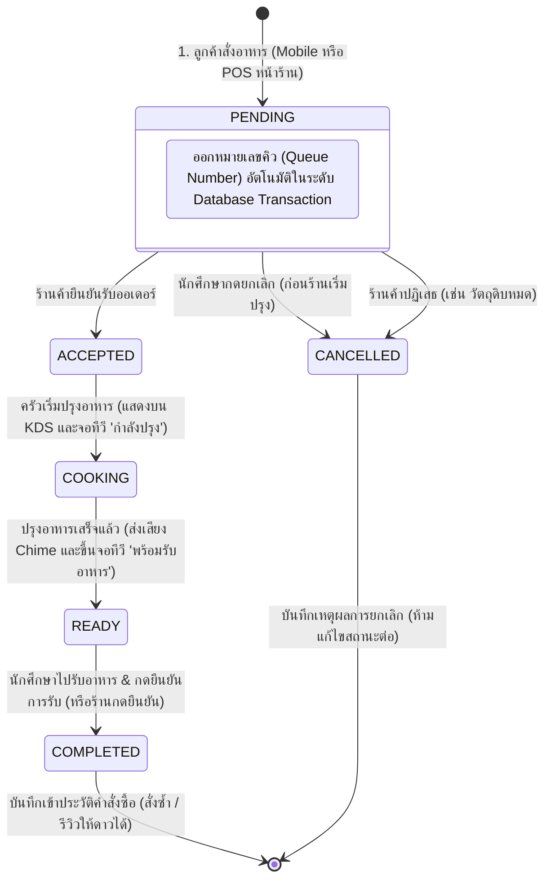
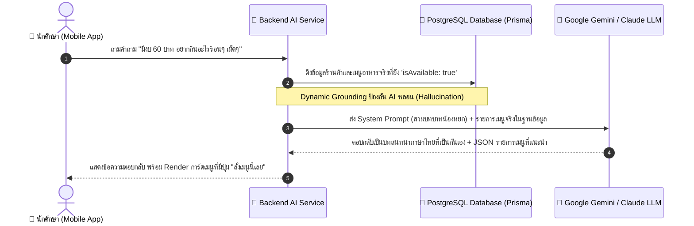

# 🎓 Campus Food: Smart Canteen & AI-Powered Food Ordering Ecosystem 🍔⚡

> **ระบบสั่งอาหารโรงอาหารมหาวิทยาลัยอัจฉริยะแบบครบวงจร (Full-cycle Smart Canteen Platform)**  
> พัฒนาด้วยสถาปัตยกรรม **Monorepo (TypeScript 100%)** ครอบคลุมทั้ง **แอปพลิเคชันมือถือนักศึกษา**, **เว็บแดชบอร์ดร้านค้า**, **ระบบคิดเงินหน้าร้าน (POS)**, **จอแสดงผลในครัว (KDS)**, **จอแสดงคิวลูกค้า (Queue TV Board)**, **จอสอง Sunmi POS** และ **ผู้ช่วย AI อัจฉริยะ "น้องหยก"** พร้อมระบบติดตามคิวและคำสั่งซื้อแบบ **Real-time (WebSockets)**

---

## 🏗️ 1. สถาปัตยกรรมระบบและแผนผังการทำงาน (System Architecture Diagram)

---

## 🔄 2. วงจรชีวิตของคำสั่งซื้อ (Order Lifecycle State Machine)

---

## 🤖 3. แผนภาพการทำงานของระบบ AI น้องหยก (AI Grounding Workflow)

---

## 🛠️ 4. ตารางเทคโนโลยีและ Framework ที่เลือกใช้ (Technology Stack)

| เลเยอร์ / ส่วนงาน | เทคโนโลยีที่เลือกใช้ | ภาษา / เครื่องมือ | บทบาทและหน้าที่ในระบบ |
| :--- | :--- | :--- | :--- |
| **Monorepo Architecture** | **pnpm Workspace** | YAML / Node.js | จัดการ Dependency และแชร์แพ็กเกจข้ามโปรเจกต์ |
| **Language Baseline** | **TypeScript 5.x** | TypeScript | ภาษาหลัก 100% ทั้ง Frontend, Mobile, Backend และ Shared Types |
| **Backend Framework** | **NestJS 10** | TypeScript | แบ็กเอนด์ระดับ Enterprise (Modular, Dependency Injection, Clean Architecture) |
| **Database ORM** | **Prisma ORM 6.x** | Prisma Schema / SQL | ตัวเชื่อมฐานข้อมูลแบบ Type-safe และจัดการ Composite Indexes |
| **Database** | **PostgreSQL 16** | SQL / Relational | ฐานข้อมูลหลัก รองรับ ACID Transactions และ Concurrent Connections |
| **In-Memory Cache** | **Bounded LRU Memory Cache** | TypeScript | แคชข้อมูลเมนูและร้านค้า ป้องกัน Memory Leak (Bounded Max Size) |
| **Real-time Engine** | **Socket.IO (WebSockets)** | WebSocket Protocol | ระบบรับ-ส่งสัญญาณแจ้งเตือนออเดอร์และบัตรคิวแบบ Real-time ความหน่วงต่ำ |
| **Web Framework** | **Next.js 14 (App Router)** | TSX / React 18 | ระบบเว็บแอปพลิเคชันสำหรับ Dashboard, POS, KDS, Queue TV และ Sunmi Display |
| **Web Styling** | **Tailwind CSS + Lucide Icons** | PostCSS / CSS3 | ออกแบบดีไซน์ทันสมัย Responsive Dark Glassmorphism |
| **Web Data & Cache** | **TanStack React Query v5** | TypeScript | จัดการ Server State, Caching, และ Optimistic Updates |
| **Mobile Framework** | **React Native (Expo SDK 54)** | TSX / React 19 | พัฒนา Cross-Platform Mobile App (iOS & Android) |
| **Mobile Routing** | **Expo Router v6** | TypeScript | ระบบจัดการหน้าจอแบบ File-based Navigation Routing |
| **Mobile Security** | **Expo SecureStore Adapter** | TypeScript | จัดการ State น้ำหนักเบา (Zustand) พร้อมเข้ารหัส Token ใน Hardware Keystore |
| **AI Intelligence** | **Anthropic Claude & Gemini** | REST / AI SDK | สมองกลผู้ช่วย AI "น้องหยก" และระบบ AI Analytics Copilot ด้วย Function Calling |
| **DevOps & Container** | **Docker & GitHub Actions** | Dockerfile / YAML | Multi-stage Docker Builds, Compose Orchestration และ Automated CI Pipeline |
| **Testing Suite** | **Jest + ts-jest** | TypeScript | ชุดทดสอบ Unit Tests ครอบคลุม Business Logic ทั้งหมด |

---

## ⚡ 5. ระบบทำงานอย่างไร (How It Works & Capabilities)

### 📱 1. สำหรับนักศึกษา (Student Mobile App)
- **ร้านค้าและเมนูอาหาร**: เลือกร้านค้าในโรงอาหาร ดูเมนูแนะนำประจำวัน และสถานะเปิด/ปิดร้าน
- **Interactive Stepper**: ปรับจำนวนอาหาร `+` / `-` ได้ทันทีจากหน้ารายการเมนู
- **Persistent Cart**: ตะกร้าสินค้าถูกบันทึกในเครื่อง ไม่สูญหายเมื่อปิดแอป
- **Dynamic PromptPay & Cash**: ชำระเงินผ่าน PromptPay Dynamic QR Code ต่อร้านค้า หรือเงินสดหน้าร้าน
- **Real-time Queue Tracking**: บัตรคิวพร้อมตัวเลขขนาดใหญ่ และ Timeline ติดตามสถานะแบบ Real-time
- **AI น้องหยก Assistant**: แชทบอทแนะนำเมนูอาหารตามงบประมาณ รสชาติ และความต้องการ พร้อมปุ่มกดสั่งได้ทันที

### 💻 2. สำหรับผู้ประกอบการร้านค้า (Vendor Dashboard)
- **Live Kanban Order Board**: จัดการออเดอร์ 3 ขั้นตอน _(รอยืนยัน ➔ กำลังปรุง ➔ พร้อมรับอาหาร)_ พร้อมเสียงแจ้งเตือน
- **Menu & Stock Management**: จัดการเมนูอาหาร เปิด-ปิดการขาย (In-stock / Out-of-stock) และ Soft Delete
- **AI Food Photography**: สร้างรูปภาพเมนูอาหารคุณภาพสูงด้วย AI เพื่อนำไปใช้เป็นรูปประกอบเมนู
- **Sales Analytics & Peak Hours**: วิเคราะห์สถิติยอดขายรวม จำนวนออเดอร์ และช่วงเวลาเร่งด่วนของร้านค้า

### 🧾 3. ระบบคิดเงินหน้าร้าน (POS System - `/pos`)
- **Fast Touch Ordering**: พนักงานหน้าร้านเลือกเมนู ปรับตัวเลือก และเพิ่มลงตะกร้าได้อย่างรวดเร็ว
- **Split Payment**: รองรับทั้งเงินสด (พร้อมระบบคำนวณเงินทอน) และสร้าง PromptPay Dynamic QR
- **Thermal Receipt Slip Printing**: สั่งพิมพ์สลิปใบเสร็จและบัตรคิวขนาด 80mm/58mm อัตโนมัติ

### 👨‍🍳 4. ระบบจอสัมผัสในครัว (Kitchen Display System - `/kds`)
- **High-Contrast Dark Theme**: ออกแบบให้อ่านง่าย ชัดเจน ในสภาพแวดล้อมครัว
- **Order Preparation Timer**: มีตัวนับเวลาความล่าช้า แจ้งเตือนด้วยสีเมื่อออเดอร์รอนานเกินเกณฑ์
- **Sound Alerts**: เสียงแจ้งเตือนระดับกระดิ่งครัวเมื่อมีออเดอร์ใหม่เข้ามา

### 📺 5. จอแสดงผลคิวสำหรับลูกค้า (Queue Display Board - `/queue-display`)
- **Full-Screen TV Display**: หน้าจอทีวีขนาดใหญ่ติดตั้งหน้าร้านหรือใจกลางโรงอาหาร
- **Split View**: แยกฝั่งชัดเจนระหว่าง "กำลังปรุงอาหาร (Preparing)" และ "พร้อมรับอาหารแล้ว (Ready for Pickup)"
- **Audio Chime System**: ส่งเสียงสัญญาณ Chime สองโทนแจ้งเตือนอัตโนมัติเมื่อมีหมายเลขคิวใหม่ที่อาหารปรุงเสร็จ

### 🖥️ 6. ระบบจอสอง Sunmi POS (`/sunmi`, `/sunmi-display`)
- รองรับเครื่อง POS แบรนด์ Sunmi หรือจอ Dual-Screen สำหรับหันหน้าให้ลูกค้า
- แสดงรายการสินค้าที่กำลังสั่งแบบ Real-time พร้อมแสดง PromptPay QR Code ขนาดใหญ่ให้ลูกค้าสแกนจ่าย

---

  <b>🎓 Campus Food Ordering System</b> — พัฒนาด้วยความพิถีพิถัน เพื่อยกระดับประสบการณ์การสั่งอาหารในโรงอาหารมหาวิทยาลัยให้สะดวก รวดเร็ว และทันสมัยที่สุด ✨

