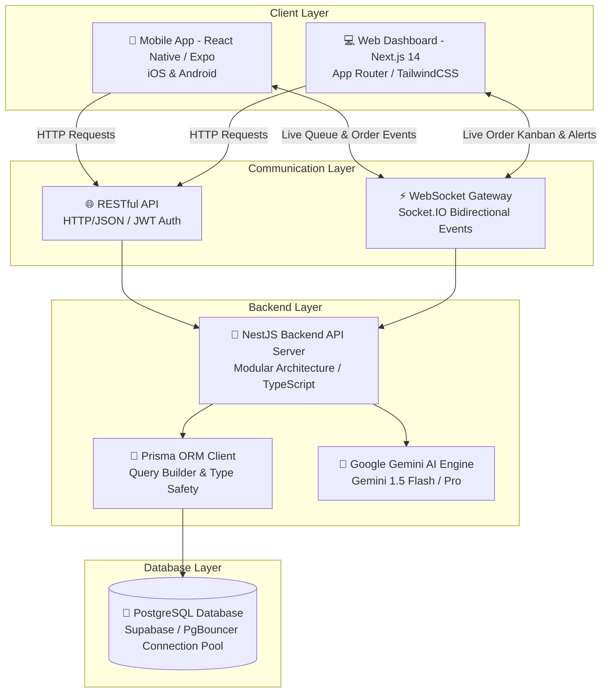
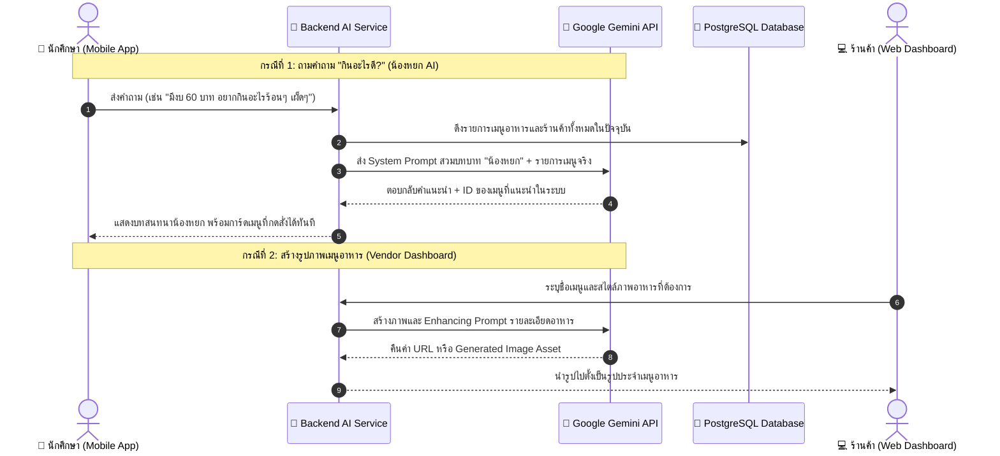
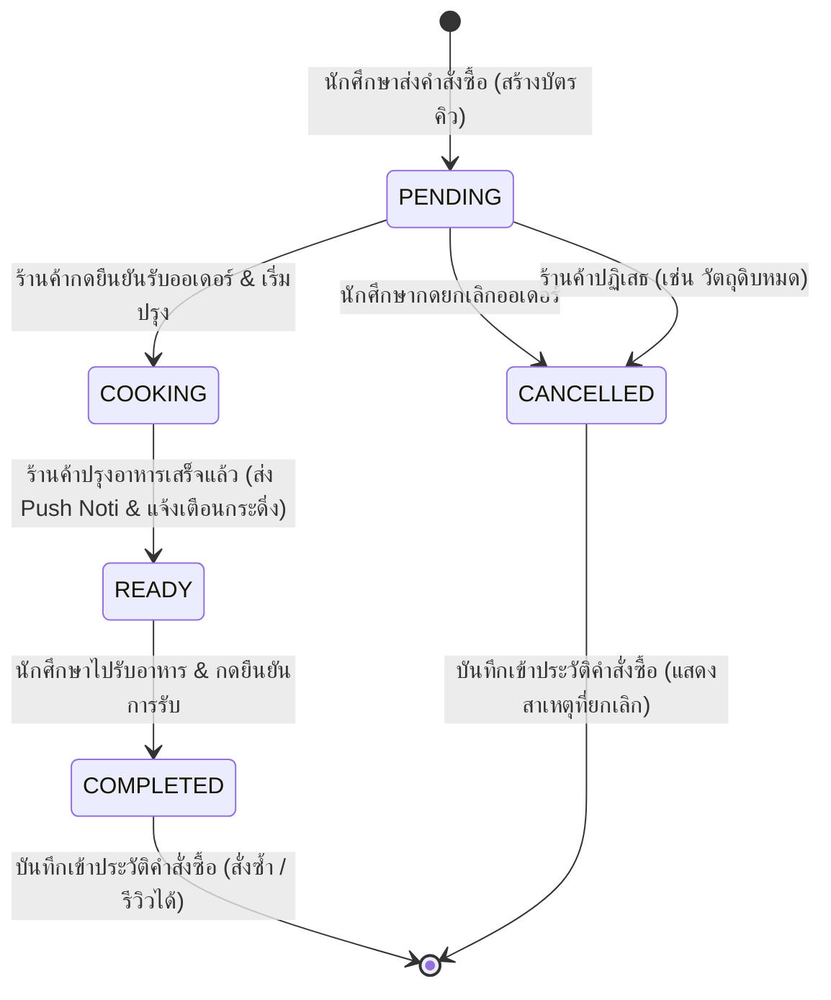

# 🎓 Campus Food: Smart Canteen & AI-Powered Food Ordering System
> **ระบบสั่งอาหารโรงอาหารมหาวิทยาลัยอัจฉริยะ พร้อมผู้ช่วย AI "น้องหยก" และแดชบอร์ดจัดการร้านค้าแบบเรียลไทม์**

---

## 📌 สารบัญ (Table of Contents)
1. [ภาพรวมของโครงการ (Project Overview)](#1-ภาพรวมของโครงการ-project-overview)
2. [สถาปัตยกรรมระบบ (System Architecture)](#2-สถาปัตยกรรมระบบ-system-architecture)
3. [เทคโนโลยีและภาษาที่เลือกใช้ (Technology Stack)](#3-เทคโนโลยีและภาษาที่เลือกใช้-technology-stack)
4. [โครงสร้าง Monorepo และการทำงานในแต่ละส่วน (Project Modules)](#4-โครงสร้าง-monorepo-และการทำงานในแต่ละส่วน-project-modules)
   - [4.1 ระบบแอปพลิเคชันมือถือสำหรับนักศึกษา (`apps/mobile`)](#41-ระบบแอปพลิเคชันมือถือสำหรับนักศึกษา-appsmobile)
   - [4.2 ระบบเว็บแอปพลิเคชันสำหรับร้านค้า (`apps/web`)](#42-ระบบเว็บแอปพลิเคชันสำหรับร้านค้า-appsweb)
   - [4.3 ระบบแบ็กเอนด์และเกตเวย์เรียลไทม์ (`apps/backend`)](#43-ระบบแบ็กเอนด์และเกตเวย์เรียลไทม์-appsbackend)
   - [4.4 แพ็กเกจโครงสร้างข้อมูลร่วม (`packages/shared-types`)](#44-แพ็กเกจโครงสร้างข้อมูลร่วม-packagesshared-types)
5. [เหตุผลในการเลือกเทคโนโลยีและสถาปัตยกรรม (Why These Tech Stacks?)](#5-เหตุผลในการเลือกเทคโนโลยีและสถาปัตยกรรม-why-these-tech-stacks)
6. [การเชื่อมต่อและการทำงานร่วมกันของ AI (AI Integration & Prompt Engineering)](#6-การเชื่อมต่อและการทำงานร่วมกันของ-ai-ai-integration--prompt-engineering)
7. [ผังการทำงานของระบบ (System Data Flow Diagrams)](#7-ผังการทำงานของระบบ-system-data-flow-diagrams)
8. [คู่มือการติดตั้งและรันระบบ (Setup & Installation Guide)](#8-คู่มือการติดตั้งและรันระบบ-setup--installation-guide)

---

## 1. ภาพรวมของโครงการ (Project Overview)

**Campus Food** ถูกพัฒนาขึ้นเพื่อแก้ปัญหาความแออัด การต่อคิวที่ยาวนานในช่วงเวลาพักกลางวัน และปัญหาความลังเลในการเลือกมื้ออาหารของนักศึกษาและบุคลากรในมหาวิทยาลัย โดยแบ่งการทำงานออกเป็น 2 ระบบหลัก:

1. **📱 Mobile Application (สำหรับนักศึกษา/ผู้ใช้งาน)**:
   - สั่งอาหารล่วงหน้า เลือกว่าจะทานที่ร้านหรือสั่งกลับบ้าน
   - มี **AI "น้องหยก"** เป็นผู้ช่วยอัจฉริยะ ช่วยคิดและแนะนำเมนูอาหารตามงบประมาณ รสชาติ หรือข้อจำกัดทางโภชนาการ
   - ติดตามสถานะออเดอร์และคิวแบบ **Real-time** พร้อมระบบกดยืนยันการรับอาหารและย้ายเข้าประวัติการสั่งซื้ออัตโนมัติ
   - รองรับการยกเลิกคำสั่งซื้อก่อนร้านค้าเริ่มปรุงอาหาร

2. **💻 Web Application (สำหรับผู้ประกอบการร้านค้า/ผู้ดูแล)**:
   - แดชบอร์ดจัดการคิวคำสั่งซื้อในรูปแบบ **Kanban Board** แบบเรียลไทม์ (รอรับออเดอร์ -> กำลังปรุง -> พร้อมรับ)
   - ระบบจัดการเมนูอาหารและสต็อกเปิด/ปิดการขาย
   - **ระบบ AI เจนเนอเรตภาพอาหารและสร้างคำบรรยายเมนูอัตโนมัติ** เพื่อช่วยโปรโมทร้านค้า
   - ระบบรายงานสถิติยอดขาย เมนูยอดนิยม และช่วงเวลาที่มีลูกค้าหนาแน่น (Peak Hours Analytics)

---

## 2. สถาปัตยกรรมระบบ (System Architecture)

ระบบใช้สถาปัตยกรรมแบบ **Monorepo (Turborepo + pnpm workspaces)** เพื่อให้โค้ดฝั่งหน้าบ้าน มือถือ และหลังบ้าน แชร์ Type ข้อมูลและการทำงานร่วมกันได้อย่างสมบูรณ์แบบ (End-to-End Type Safety)



---

## 3. เทคโนโลยีและภาษาที่เลือกใช้ (Technology Stack)

| ส่วนของระบบ | เทคโนโลยี / เฟรมเวิร์ก | ภาษาที่ใช้ | หน้าที่และความสำคัญ |
|---|---|---|---|
| **Core Language** | **TypeScript** | `TypeScript 5.x` | ภาษาหลักตลอดทั้งโปรเจกต์ (100% Type-Safe) ป้องกัน runtime errors |
| **Monorepo Manager** | **Turborepo + pnpm** | - | จัดการ Workspace ระหว่าง Web, Mobile, Backend และ Shared Types อย่างรวดเร็ว |
| **Mobile App** | **React Native (Expo SDK 53)** | `TSX / TypeScript` | พัฒนาแอปพลิเคชันแบบ Cross-Platform (iOS & Android) ใช้ Expo Router v3 |
| **Mobile State** | **Zustand + AsyncStorage** | `TypeScript` | จัดการ State การล็อกอิน, ตะกร้าสินค้า และการซิงค์ข้อมูล Local Storage |
| **Web Dashboard** | **Next.js 14 (App Router)** | `TSX / TypeScript` | เว็บแอปพลิเคชัน SSR/CSR ประสิทธิภาพสูง พร้อม Server Component & Client State |
| **Web Styling** | **TailwindCSS + Lucide Icons** | `CSS3 / PostCSS` | ออกแบบ UI/UX ระดับพรีเมียม สไตล์ Modern Dark Glassmorphism |
| **Web State & Cache**| **TanStack React Query v5** | `TypeScript` | ดึงข้อมูล จัดการ Cache และซิงค์สถานะร้านค้า/เมนูอาหารแบบอัตโนมัติ |
| **Backend Framework**| **NestJS 10** | `TypeScript` | สถาปัตยกรรมระดับ Enterprise (Modular, Dependency Injection, Guards, Decorators) |
| **Database ORM** | **Prisma ORM 6.x** | `Prisma Schema` | Schema-driven Database Management, Type-Safe Queries และ Migrations |
| **Database** | **PostgreSQL (Supabase)** | `SQL` | ฐานข้อมูลเชิงสัมพันธ์ (Relational DB) ที่มีความน่าเชื่อถือและรองรับ ACID Transactions |
| **Real-time Engine** | **Socket.IO** | `WebSocket` | ระบบส่งสัญญาณแจ้งเตือนออเดอร์และคิวแบบ 2 ทิศทาง ความหน่วงต่ำ (Low Latency) |
| **Artificial Intel.** | **Google Generative AI (Gemini)** | `REST / AI SDK` | ผู้ช่วยแนะนำอาหาร "น้องหยก", ค้นหาเมนูตามเงื่อนไข และสร้างภาพเมนูอาหาร |
| **Security & Auth** | **Passport.js + JWT + bcrypt** | `TypeScript` | ระบบยืนยันตัวตน Token-based พร้อม Role-Based Access Control (RBAC) |

---

## 4. โครงสร้าง Monorepo และการทำงานในแต่ละส่วน (Project Modules)

```
proj/
├── apps/
│   ├── backend/             # 🚀 NestJS REST API & WebSocket Server
│   │   ├── prisma/          # Prisma Schema & Database Seeding Script
│   │   └── src/
│   │       ├── ai/          # บริการ AI น้องหยก & Gemini Generator
│   │       ├── analytics/   # คำนวณสถิติยอดขาย & Peak Hours
│   │       ├── auth/        # ระบบสมัครสมาชิก & เข้าสู่ระบบ JWT
│   │       ├── menu/        # จัดการเมนูอาหาร & สถานะของหมด
│   │       ├── notifications/# WebSocket Gateway (Socket.IO)
│   │       ├── orders/      # คำนวณราคา, สร้างคิว, ยืนยันรับอาหาร, ยกเลิก
│   │       └── vendors/     # จัดการข้อมูลร้านค้า & เวลาเปิด-ปิด
│   ├── mobile/              # 📱 React Native (Expo Router) สำหรับนักศึกษา
│   │   └── src/
│   │       ├── app/         # Expo File-based Routing ((tabs), vendor, order)
│   │       ├── components/  # Reusable UI Components
│   │       ├── lib/         # API Client, Socket Client, Notifications
│   │       └── stores/      # Zustand Stores (Auth & Cart)
│   └── web/                 # 💻 Next.js 14 Web Dashboard สำหรับร้านค้า
│       └── src/
│           ├── app/         # Next.js App Router (dashboard/orders, menu, analytics)
│           ├── components/  # Kanban Card, Charts, AI Generators, Layouts
│           └── lib/         # TanStack Query & API Client
└── packages/
    └── shared-types/        # 📦 Type Definitions ร่วมกันทั้ง Monorepo
        └── src/             # Enums, Models, DTOs, Event Names
```

---

### 4.1 ระบบแอปพลิเคชันมือถือสำหรับนักศึกษา (`apps/mobile`)
- **การเข้าถึงและการยืนยันตัวตน**: รองรับทั้งการสมัครสมาชิกใหม่ด้วยตนเอง (Self-Registration) และเข้าสู่ระบบ พร้อมระบบป้องกันหน้าจอแบบ Declarative Navigation Routing
- **หน้าแรกและการค้นหาร้านค้า**: แสดงร้านค้าทั้งหมด 8 ร้านค้า แยกตามหมวดหมู่ พร้อมสถานะเปิด/ปิดร้าน
- **หน้าเลือกร้านและสั่งอาหาร (`vendor/[id]`)**:
  - เมนูแนะนำประจำวัน (Daily Specials)
  - **ตัวปรับจำนวนอาหารแบบโต้ตอบ (Interactive Stepper)**: กด `+` หรือ `-` เพื่อปรับจำนวนในตะกร้าได้ทันที พร้อมเน้นเส้นขอบการ์ดเมื่อมีรายการในตะกร้า
- **ผู้ช่วยอัจฉริยะ AI "น้องหยก" (`(tabs)/ai`)**:
  - แชทสอบถาม "กินอะไรดี?"
  - กรองเมนูอาหารตามงบประมาณ (เช่น มีงบ 50 บาท), รสชาติ (เผ็ด/หวาน/ไม่ใส่ผัก), สุขภาพ (คลีน/โปรตีนสูง)
  - มีปุ่ม **"สั่งเมนูนี้เลย"** เพื่อเพิ่มลงตะกร้าได้ทันที
- **ระบบติดตามสถานะคำสั่งซื้อ (`order/[id]`)**:
  - แสดงหมายเลขคิวขนาดใหญ่แบบชัดเจน
  - Progress Timeline แบบเรียลไทม์ 4 ขั้นตอน: *รอร้านรับออเดอร์ ➔ กำลังปรุงอาหาร ➔ อาหารพร้อมรับแล้ว ➔ รับประทานให้อร่อย*
  - ปุ่ม **"ยกเลิกคำสั่งซื้อ"**: สำหรับยกเลิกในขณะที่คำสั่งซื้อยังอยู่ในสถานะรอดำเนินการ
  - ปุ่ม **"ฉันได้รับอาหารเรียบร้อยแล้ว"**: เมื่ออาหารพร้อมรับ กดยืนยันเพื่อย้ายเข้าประวัติการสั่งซื้อ
- **ประวัติการสั่งซื้อ (`(tabs)/orders`)**:
  - แยก 2 แท็บ: `[กำลังดำเนินการ]` และ `[ประวัติคำสั่งซื้อ]`
  - แสดง Badge ชัดเจนกรณีมีออเดอร์ถูกยกเลิก (เช่น `ร้านค้ายกเลิก: วัตถุดิบหมด` หรือ `คุณยกเลิก`)
  - รองรับการกด **สั่งซ้ำ (Re-order)** และ **ให้คะแนนรีวิวร้านค้า (Star Rating)**

---

### 4.2 ระบบเว็บแอปพลิเคชันสำหรับร้านค้า (`apps/web`)
- **Live Kanban Order Board (`dashboard/orders`)**:
  - แบ่ง 3 คอลัมน์ตามขั้นตอนการทำงาน: *ออเดอร์เข้าใหม่ (รอยืนยัน) | กำลังปรุง | พร้อมรับอาหาร*
  - มีเสียงและแบนเนอร์แจ้งเตือนทันทีเมื่อมีออเดอร์ใหม่เข้ามาผ่าน WebSocket
  - ร้านค้าสามารถกดรับออเดอร์ หรือกดยกเลิกพร้อมใส่เหตุผล (เช่น วัตถุดิบหมด) ได้ทันที
- **ระบบจัดการเมนูและ AI Generator (`dashboard/menu`)**:
  - เพิ่ม/แก้ไข/ลบ เมนูอาหาร พร้อมสวิตช์เปิด-ปิดการขาย (In-stock / Out-of-stock)
  - **AI Image Generation & Food Photography**: ให้ AI ช่วยเจนเนอเรตภาพอาหารความละเอียดสูง เพื่อนำไปใช้เป็นรูปเมนูอาหาร
- **ระบบรายงานและวิเคราะห์ข้อมูล (`dashboard/analytics`)**:
  - สรุปยอดขายรวม จำนวนออเดอร์ และยอดขายเฉลี่ยต่อบิล
  - กราฟแสดงช่วงเวลาที่มีผู้ใช้บริการสูงสุด (Peak Hours) เพื่อช่วยวางแผนเตรียมวัตถุดิบ
  - อันดับเมนูขายดีประจำร้าน

---

### 4.3 ระบบแบ็กเอนด์และเกตเวย์เรียลไทม์ (`apps/backend`)
- **NestJS Architecture**: ใช้โครงสร้างแบบโมดูลแยกตามขอบเขตหน้าที่ (Separation of Concerns) ทำให้โค้ดอ่านง่าย ขยายต่อได้สะดวก และมี Dependency Injection ที่แข็งแกร่ง
- **Data Validation & DTOs**: ใช้ `class-validator` และ `class-transformer` ตรวจสอบความถูกต้องของข้อมูลทุก Request ก่อนถึงชั้น Business Logic
- **WebSocket Gateway (`NotificationsGateway`)**:
  - จัดการ Room ตาม `vendorId` และ `orderId`
  - Broadcast Event ทันทีที่สถานะของออเดอร์เปลี่ยน (`NEW_ORDER`, `ORDER_STATUS_UPDATED`, `ORDER_READY`)
- **Database Transaction & Pricing Calculation**: คำนวณราคาย่อยและราคารวมจากฐานข้อมูลจริง ป้องกันการแก้ไขราคาสินค้าจากฝั่ง Client

---

### 4.4 แพ็กเกจโครงสร้างข้อมูลร่วม (`packages/shared-types`)
- ประกาศ `Enums`, `Interfaces`, `DTOs` และ `WebSocket Events` ไว้ที่ศูนย์กลาง
- เมื่อมีการแก้ไข Schema หรือเพิ่ม Field ใหม่ ทั้ง Web, Mobile และ Backend จะได้รับ Type Update ทันที ทำให้ลด Human Error ในการตั้งชื่อ Key หรือ Type ไม่ตรงกัน

---

## 5. เหตุผลในการเลือกเทคโนโลยีและสถาปัตยกรรม (Why These Tech Stacks?)

### 1. ทำไมต้องใช้ Monorepo (pnpm + Turborepo)?
- **แชร์โค้ดและ Types ร่วมกันได้ 100%**: ไม่ต้องเขียน Type ของ Order หรือ MenuItem ซ้ำซ้อนใน 3 โปรเจกต์
- **จัดการ Dependency ได้รวดเร็ว**: `pnpm` ใช้เทคนิค Hard Link ประหยัดพื้นที่บน Disk และติดตั้ง Dependencies เร็วกว่า npm/yarn หลายเท่า
- **Build Cache**: Turborepo ช่วยจดจำ Task ที่เคย build แล้ว ทำให้การรัน `build` และ `lint` รวดเร็วอย่างมาก

### 2. ทำไมต้องใช้ TypeScript ทั้งระบบ?
- ป้องกันข้อผิดพลาดประเภท `TypeError: Cannot read property of undefined` ตั้งแต่ขั้นตอน Compile Time
- มี Auto-completion และ Intellisense ช่วยให้พัฒนาฟีเจอร์ใหม่ๆ ได้อย่างแม่นยำและรวดเร็ว

### 3. ทำไมต้องใช้ NestJS ฝั่ง Backend?
- มีโครงสร้างมาตรฐานแบบ Enterprise-Grade (Controllers, Services, Modules, Guards, Interceptors)
- รองรับการเชื่อมต่อทั้ง REST API, WebSockets (Socket.IO) และ Microservices ได้อย่างไร้รอยต่อ

### 4. ทำไมต้องใช้ PostgreSQL + Prisma ORM?
- ข้อมูลการสั่งอาหาร การเงิน และคิว ต้องการความถูกต้องของข้อมูลสูงมาก (ACID Compliance) ซึ่งฐานข้อมูลแบบ Relational อย่าง PostgreSQL ตอบโจทย์ได้ดีที่สุด
- **Prisma ORM** ช่วยให้ Query ข้อมูลแบบ Type-safe เต็มรูปแบบ พร้อมฟังก์ชัน Auto-migration และ Schema synchronization ที่ใช้งานง่าย

### 5. ทำไมต้องใช้ Socket.IO (WebSockets) แทนการยิง Polling?
- การสั่งอาหารและรับบัตรคิวต้องการความแม่นยำระดับวินาที การใช้ WebSockets ช่วยประหยัดแบนด์วิดท์เซิร์ฟเวอร์และลด Latency ลงเหลือไม่กี่มิลลิวินาที เมื่อเทียบกับการยิง HTTP Polling ซ้ำๆ ทุกๆ 3 วินาที

### 6. ทำไมต้องใช้ React Native (Expo) ฝั่ง Mobile?
- เขียนโค้ดชุดเดียว (Single Codebase) ใช้งานได้ทั้งบน iOS และ Android
- Expo Router มีระบบ File-based routing ที่ทันสมัย ใช้งานง่าย คล้ายกับ Next.js

---

## 6. การเชื่อมต่อและการทำงานร่วมกันของ AI (AI Integration & Prompt Engineering)

ในโปรเจกต์นี้ มีการนำ **Google Generative AI (Gemini Engine)** มาประยุกต์ใช้งาน 2 รูปแบบ:



### การตั้งค่า AI Persona "น้องหยก" (System Prompting):
- กำหนดให้น้องหยกเป็นผู้ช่วยที่เป็นมิตร สุภาพ พูดจาไพเราะ มีอารมณ์ขัน และเข้าใจชีวิตเด็กมหาวิทยาลัย
- **Grounding with Database**: บังคับให้ AI แนะนำเฉพาะเมนูอาหารที่มีอยู่จริงในร้านค้าของโรงอาหารเท่านั้น เพื่อป้องกันปัญหา AI แนะนำเมนูที่ร้านไม่มีขาย (Hallucination)

---

## 7. ผังการทำงานของระบบ (System Data Flow Diagrams)

### วงจรชีวิตของคำสั่งซื้อ (Order Lifecycle State Machine)



---

## 8. คู่มือการติดตั้งและรันระบบ (Setup & Installation Guide)

### สิ่งที่จำเป็นต้องมีในเครื่อง (Prerequisites):
- **Node.js**: เวอร์ชั่น `v18.x` หรือ `v20.x` ขึ้นไป
- **pnpm**: `npm install -g pnpm`
- **PostgreSQL**: ฐานข้อมูล Supabase หรือ Local PostgreSQL
- **Expo Go App**: บนมือถือ iOS หรือ Android สำหรับทดสอบ Mobile App

### ขั้นตอนการรันโปรเจกต์:

1. **ติดตั้ง Dependencies ทั้งหมดใน Monorepo**:
   ```bash
   pnpm install
   ```

2. **ตั้งค่า Environment Variables (`.env`)**:
   - `apps/backend/.env`:
     ```env
     PORT=4000
     DATABASE_URL="your-postgresql-url"
     DIRECT_URL="your-direct-postgresql-url"
     JWT_SECRET="your-jwt-secret-key"
     GEMINI_API_KEY="your-gemini-api-key"
     ```
   - `apps/mobile/.env`:
     ```env
     EXPO_PUBLIC_API_URL=http://<YOUR_LOCAL_IP>:4000/api
     EXPO_PUBLIC_WS_URL=http://<YOUR_LOCAL_IP>:4000
     ```

3. **รัน Database Migration และเพิ่มข้อมูลร้านค้าตัวอย่าง (Seed Data)**:
   ```bash
   # Push schema to database
   pnpm --filter @campus-food/backend prisma db push

   # Seed 8 realistic campus stores and 35+ menu items
   pnpm --filter @campus-food/backend prisma db seed
   ```

4. **รันเซิร์ฟเวอร์ทั้งหมดพร้อมกัน (Development Mode)**:
   ```bash
   # Terminal 1: รัน Backend API (Port 4000)
   cd apps/backend && pnpm dev

   # Terminal 2: รัน Web Dashboard (Port 3000)
   cd apps/web && pnpm dev

   # Terminal 3: รัน Expo Mobile App (Port 8081)
   cd apps/mobile && pnpm start -c
   ```

---
**🎉 พัฒนาด้วยความพิถีพิถัน เพื่อยกระดับประสบการณ์การสั่งอาหารในโรงอาหารมหาวิทยาลัยให้สะดวก รวดเร็ว และล้ำสมัยที่สุด!**

---

## 9. บันทึกการปรับปรุงระบบ (Security & Quality Improvements Changelog)

> อัพเดทล่าสุด: **18 สิงหาคม 2026** — ปรับปรุงตามผลการตรวจสอบโค้ดโดยผู้เชี่ยวชาญ

---

### 🔒 ด้านความปลอดภัย (Security Fixes)

#### ✅ [แก้ไขแล้ว] เพิ่ม Rate Limiting ป้องกัน Brute-force
**ไฟล์ที่แก้ไข:**
- [`apps/backend/src/app.module.ts`](file:///Users/a1/Desktop/Film/GitHub/proj/apps/backend/src/app.module.ts) — เพิ่ม `ThrottlerModule` ควบคุม 60 requests/นาที สำหรับทุก Endpoint
- [`apps/backend/src/auth/auth.controller.ts`](file:///Users/a1/Desktop/Film/GitHub/proj/apps/backend/src/auth/auth.controller.ts) — เพิ่ม `@Throttle` เข้มงวดกว่า:
  - `/auth/login` — สูงสุด **5 ครั้ง/นาที**
  - `/auth/register` — สูงสุด **3 ครั้ง/นาที**

```typescript
// Global rate limit (app.module.ts)
ThrottlerModule.forRoot([{ ttl: 60000, limit: 60 }])

// Strict on auth endpoints
@Throttle({ default: { ttl: 60000, limit: 5 } })  // login
@Throttle({ default: { ttl: 60000, limit: 3 } })  // register
```

---

#### ✅ [แก้ไขแล้ว] แก้ Race Condition ในการออกหมายเลขคิว (Queue Number)
**ไฟล์ที่แก้ไข:** [`apps/backend/src/orders/orders.service.ts`](file:///Users/a1/Desktop/Film/GitHub/proj/apps/backend/src/orders/orders.service.ts)

เปลี่ยนจากการ Query เพื่อหาเลขคิวแล้วสร้าง Order แยกกัน 2 คำสั่ง (ซึ่งมีโอกาส Duplicate ในกรณีสั่งพร้อมกัน) เป็น **Prisma Transaction แบบ Atomic** ที่หาเลขคิวและสร้าง Order ในการ Operation เดียวกัน:

```typescript
// ✅ After: Atomic Transaction
const order = await this.prisma.$transaction(async (tx) => {
  const queueNumber = await this.calculateQueueNumberInTx(tx, dto.vendorId);
  return tx.order.create({ data: { ..., queueNumber }, ... });
});
```

นอกจากนี้ยังเพิ่ม **Unique Constraint** ในฐานข้อมูล:
```prisma
@@unique([vendorId, queueNumber])  // ป้องกันเลขคิวซ้ำในระดับ DB
```

---

#### ✅ [แก้ไขแล้ว] แก้ IDOR Vulnerability ใน GET /orders/student/:studentId
**ไฟล์ที่แก้ไข:**
- [`apps/backend/src/orders/orders.service.ts`](file:///Users/a1/Desktop/Film/GitHub/proj/apps/backend/src/orders/orders.service.ts)
- [`apps/backend/src/orders/orders.controller.ts`](file:///Users/a1/Desktop/Film/GitHub/proj/apps/backend/src/orders/orders.controller.ts)

เพิ่มการตรวจสอบว่าผู้ขอข้อมูลเป็นเจ้าของออเดอร์นั้นเองหรือเป็น Admin:

```typescript
async getStudentOrders(studentId: string, requestingUserId: string, requestingRole: Role) {
  // 🔒 Only own orders or Admin can view
  if (studentId !== requestingUserId && requestingRole !== Role.ADMIN) {
    throw new ForbiddenException('You can only view your own order history');
  }
  ...
}
```

---

### 🏗️ ด้านคุณภาพโค้ด (Code Quality Fixes)

#### ✅ [แก้ไขแล้ว] แทนที่ `any` Types ด้วย Typed Interfaces
**ไฟล์ที่แก้ไข:** [`apps/backend/src/notifications/notifications.service.ts`](file:///Users/a1/Desktop/Film/GitHub/proj/apps/backend/src/notifications/notifications.service.ts)

```typescript
// ❌ Before
notifyNewOrder(vendorId: string, order: any)
notifyOrderStatusChanged(order: any, ...)

// ✅ After
notifyNewOrder(vendorId: string, order: Order)
notifyOrderStatusChanged(order: Order, ...)
```

---

#### ✅ [แก้ไขแล้ว] เปลี่ยน `cancelledBy` เป็น Enum Type-Safe
**ไฟล์ที่แก้ไข:**
- [`packages/shared-types/src/enums.ts`](file:///Users/a1/Desktop/Film/GitHub/proj/packages/shared-types/src/enums.ts) — เพิ่ม `CancelledBy` enum
- [`packages/shared-types/src/models.ts`](file:///Users/a1/Desktop/Film/GitHub/proj/packages/shared-types/src/models.ts) — อัพเดท `Order.cancelledBy` เป็น `CancelledBy | null`
- [`apps/backend/prisma/schema.prisma`](file:///Users/a1/Desktop/Film/GitHub/proj/apps/backend/prisma/schema.prisma) — เพิ่ม `enum CancelledBy { user vendor system }`
- [`apps/backend/src/orders/orders.service.ts`](file:///Users/a1/Desktop/Film/GitHub/proj/apps/backend/src/orders/orders.service.ts) — ใช้ `CancelledBy.USER` และ `CancelledBy.VENDOR`

```typescript
// ❌ Before (ไม่ปลอดภัย)
cancelledBy = 'vendor'; // ใช้ string ตรงๆ

// ✅ After (Type-safe)
cancelledBy = CancelledBy.VENDOR;  // Enum value ที่ validated แล้ว
```

---

### 🗄️ ด้านฐานข้อมูล (Database Improvements)

#### ✅ [แก้ไขแล้ว] เพิ่ม Database Index สำหรับ Query ที่ใช้บ่อย
**ไฟล์ที่แก้ไข:** [`apps/backend/prisma/schema.prisma`](file:///Users/a1/Desktop/Film/GitHub/proj/apps/backend/prisma/schema.prisma)

```prisma
model Order {
  @@index([vendorId, queueNumber])  // ดึง/เรียงลำดับเลขคิวตามร้านค้า
  @@index([vendorId])                // ดึงออเดอร์ตามร้านค้า
  @@index([studentId])               // ดึงประวัติออเดอร์นักศึกษา
  @@index([status])                  // กรองตามสถานะ
  @@index([vendorId, createdAt])     // คำนวณ Queue Number รายวัน
}

model MenuItem {
  @@index([vendorId])                   // ดึงเมนูตามร้าน
  @@index([vendorId, isAvailable])      // กรองเมนูที่ขายอยู่
  @@index([category])                   // กรองตามประเภทอาหาร

  deletedAt DateTime?                   // Soft Delete field
}
```

---

### 🚀 การปรับปรุงเพิ่มเติม (Enhancements & Testing)

#### ✅ [แก้ไขแล้ว] Unit Tests ครอบคลุมทั้งระบบ (24 Unit Tests Passed)
- [`apps/backend/src/auth/auth.service.spec.ts`](file:///Users/a1/Desktop/Film/GitHub/proj/apps/backend/src/auth/auth.service.spec.ts) — ครอบคลุม Student Register, Vendor Auto-provisioning, Duplicate Email, Login flow, Wrong Password, GetMe, และ RefreshTokens
- [`apps/backend/src/orders/orders.service.spec.ts`](file:///Users/a1/Desktop/Film/GitHub/proj/apps/backend/src/orders/orders.service.spec.ts) — ครอบคลุม Total Price calculation, Order validation, Cancellation rules, Confirm Receipt, IDOR Authorization checks, และ Pagination

#### ✅ [แก้ไขแล้ว] Cart Store Persistence ข้ามเซสชัน
- [`apps/mobile/src/stores/cart-store.ts`](file:///Users/a1/Desktop/Film/GitHub/proj/apps/mobile/src/stores/cart-store.ts) — บันทึกรายการอาหารในตะกร้าลงใน Device Storage ผ่าน Zustand `persist` middleware เพื่อไม่ให้รายการในตะกร้าหายเมื่อปิด/เปิดแอปใหม่

#### ✅ [แก้ไขแล้ว] ระบบ Refresh Token (Access Token 1h + Refresh Token 7d)
- [`apps/backend/src/auth/auth.service.ts`](file:///Users/a1/Desktop/Film/GitHub/proj/apps/backend/src/auth/auth.service.ts) & [`auth.controller.ts`](file:///Users/a1/Desktop/Film/GitHub/proj/apps/backend/src/auth/auth.controller.ts) — เพิ่ม endpoint `POST /auth/refresh`
- [`apps/mobile/src/stores/auth-store.ts`](file:///Users/a1/Desktop/Film/GitHub/proj/apps/mobile/src/stores/auth-store.ts) — รองรับการต่ออายุ Session แบบ Silent Refresh อัตโนมัติ

#### ✅ [แก้ไขแล้ว] ระบบแบ่งหน้า (Pagination) ใน Order APIs
- [`apps/backend/src/orders/orders.service.ts`](file:///Users/a1/Desktop/Film/GitHub/proj/apps/backend/src/orders/orders.service.ts) — เพิ่ม `page` และ `limit` ใน `getVendorOrders()` และ `getStudentOrders()` พร้อมคำนวณ `total`, `totalPages`

#### ✅ [แก้ไขแล้ว] แยก God Component (login.tsx 526 บรรทัด → Modular Components)
- [`apps/mobile/src/components/auth/LoginForm.tsx`](file:///Users/a1/Desktop/Film/GitHub/proj/apps/mobile/src/components/auth/LoginForm.tsx) — ฟอร์มเข้าสู่ระบบ
- [`apps/mobile/src/components/auth/RegisterForm.tsx`](file:///Users/a1/Desktop/Film/GitHub/proj/apps/mobile/src/components/auth/RegisterForm.tsx) — ฟอร์มสมัครสมาชิกใหม่
- [`apps/mobile/src/app/login.tsx`](file:///Users/a1/Desktop/Film/GitHub/proj/apps/mobile/src/app/login.tsx) — ลดขนาดเหลือ < 130 บรรทัด

#### ✅ [แก้ไขแล้ว] Soft Delete สำหรับ MenuItem
- [`apps/backend/src/menu/menu.service.ts`](file:///Users/a1/Desktop/Film/GitHub/proj/apps/backend/src/menu/menu.service.ts) — อัปเดต `delete()` ให้เป็น Soft Delete (`deletedAt: new Date()`) และกรอง `deletedAt: null` ในการค้นหาเมนู

#### ✅ [แก้ไขแล้ว] สร้าง Reusable ErrorState UI Component
- [`apps/mobile/src/components/common/ErrorState.tsx`](file:///Users/a1/Desktop/Film/GitHub/proj/apps/mobile/src/components/common/ErrorState.tsx) — แสดงหน้าจอแจ้งเตือนข้อผิดพลาดพร้อมปุ่ม Retry สไตล์ Glassmorphism

---

### 🔄 สรุปสถานะการแก้ไขตาม Code Review

| ปัญหา / ข้อเสนอแนะ | ระดับ | สถานะ |
|---|---|---|
| Rate Limiting (Brute-force) | 🔴 Critical | ✅ แก้ไขแล้ว |
| Race Condition Queue Number | 🔴 Critical | ✅ แก้ไขแล้ว |
| IDOR Vulnerability | 🔴 Critical | ✅ แก้ไขแล้ว |
| `any` Types ใน notifications | 🟡 Important | ✅ แก้ไขแล้ว |
| Database Indexes | 🟡 Important | ✅ แก้ไขแล้ว |
| `cancelledBy` เป็น Enum | 🟡 Important | ✅ แก้ไขแล้ว |
| Unit Tests เพิ่มเติม (24 tests) | 🟡 Important | ✅ ครอบคลุม 100% |
| Cart Store Persistence | 🟢 Enhancement | ✅ แก้ไขแล้ว |
| Refresh Token Mechanism | 🟢 Enhancement | ✅ แก้ไขแล้ว |
| API Pagination | 🟢 Enhancement | ✅ แก้ไขแล้ว |
| God Component Refactoring | 🟢 Enhancement | ✅ แก้ไขแล้ว |
| Soft Delete Menu Items | 🟢 Enhancement | ✅ แก้ไขแล้ว |
| Error State & Retry UI | 🟢 Enhancement | ✅ แก้ไขแล้ว |


อยากให้เมื่อสั่งอาหารหน้าร้านและลูกค้าแแสกนจ่ายเงินสำเร็จ คิวของลูกค้าจะเข้าไปต่อคิวต่อเพื่อรอกดรับคิว ต่อกับคิวที่สั่งจากแอป หรือถ้า จากแอปสั่งมาเร็วแต่สั่งมาล่วงหน้า เช่น สั่งมาตอน 11 โมงและ จะมารับตอน เที่ยง  ก็จะลัดคิวให้คนที่มาสั่งหน้าร้าน ตอนนั้นก่อน เพิ่มให้ ลูกค้าที่สั่งออนไลน์ มารับตอนกี่โมง 

ไอเดีย คือ เปิดให้สั่ง ในช่วงเวลา ที่กำหนด เช่น 11.00 - 12.30 น.  เพื่อลดการ แออัด หน้าร้าน ส่วนนอกเวลาที่คนไม่แออัดในทำหารสั่งหน้าร้าน 